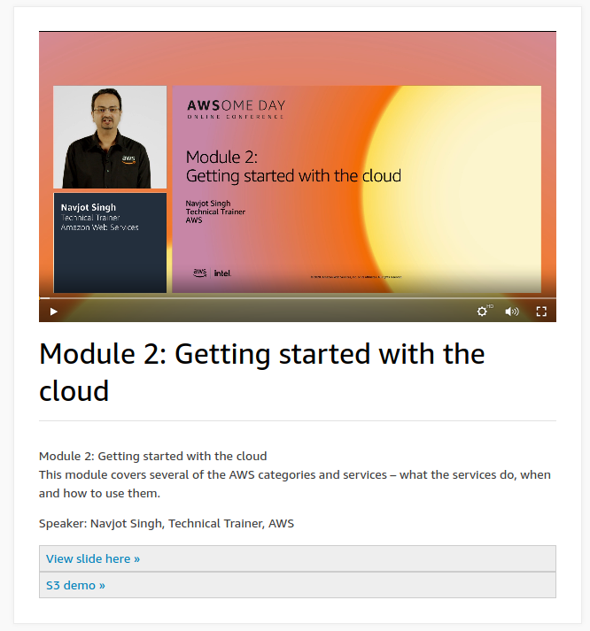

# Module 2: Getting started with the Cloud

Amazon virtual private cloud provision logically isolation section of the AWS cloud where you cn launch AWS resources in a Virtual network that you define. you have complete control election of your own IP, subnet and route tables. Allows you virtual networks called VPC. Security groups acts as the virtual firewalls, it controls the traffic in and out of AWS network. .Outbound request to receive inbound request175 service with AWS Cloud

infrastructure, resource compute storage and network platform databases analytic develop manage tools enterprise application

Build your infrastructure:

Amazon Elastic Compute Cloud Ec2 - service makes it easy to provision virtual machine or Ec2 instances in the cloud. Provides elastic or nearly unlimited compute capacity you can provision in minutes and pay for the resources you use. full control for the resources you create, windows or linux box. Plenty of options such as disk, cpu os etc. Integrates with alot of databases services such as VPC for networking, S3 for object storage RDS for database giving you a wide array of options to store and process data for your applications.

Amazon Ec2 instance powered by Xeon scalable processors. Custom intel scalable process up to 124 TB on one instance. 

Amazon elastic block store Amazon EBS - Hard rive in the cloud with 2 main categories. SSD and HDD which can be scaled down or up

Amazon Simple Storage Service S3 - highly scalable, durable to store and retrieve data and it stored within bucket with 5TB per bucket. S3 store data and resource called bucket. Your can write read within the bucket which has granular access. Used for backup and storage. 

Amazon S3 Glacier - low cost archiving for media assets, health care info etc. Deploy and enforce compliance controls. S3 has a number of storage classes such as standard.

Summary: Ec2 instance types, EBS, S3, Amazon Glacier, VPC Security groups

