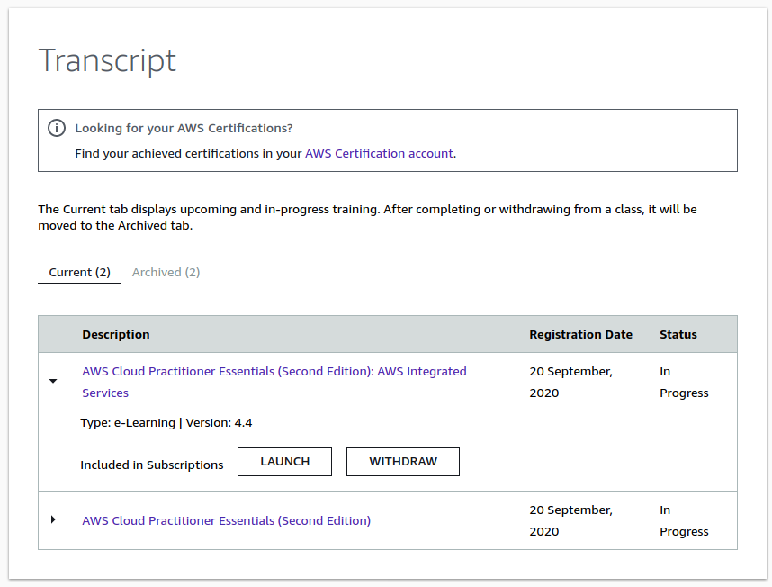
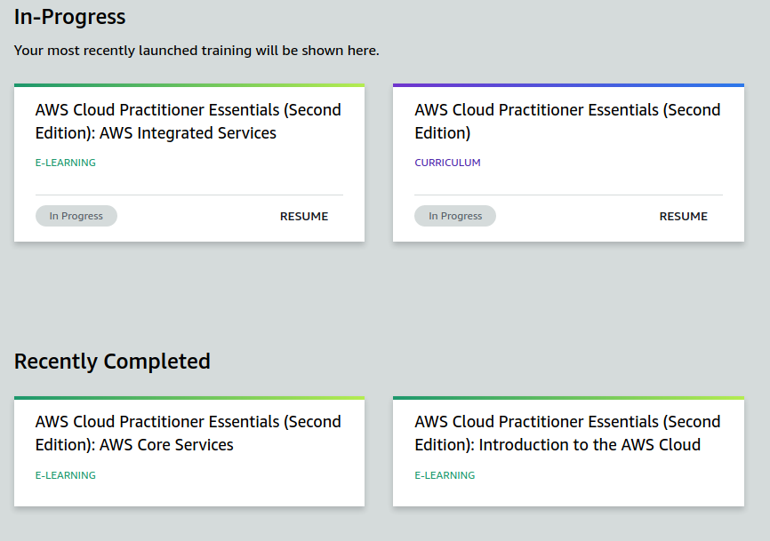

# AWS Testing Environments

While browsing on which platform to choose to learn my certification on. I signed into aws.training and found they have wonderful resources.

I've been doing a few modules from this learning forum also. 

