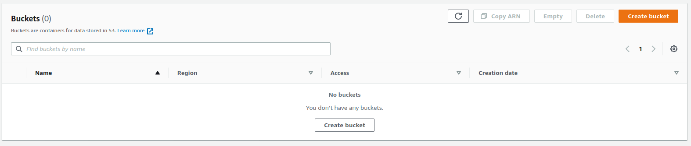
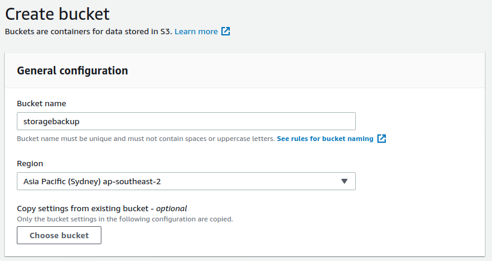
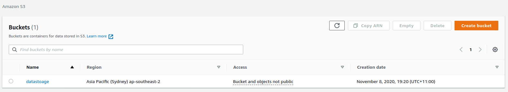
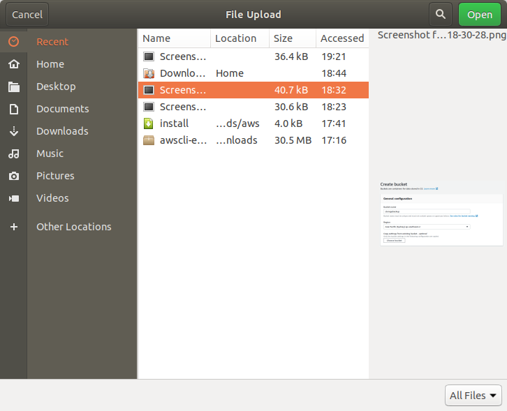
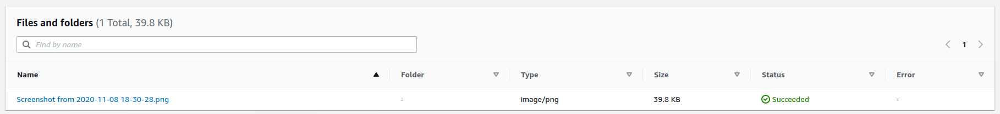

# Backup files to Amazon S3

##  Store and Retrieve a File 

This step-by-step tutorial will help you store your files in the cloud using Amazon Simple Storage Solution \(S3\). Amazon S3 is a service that enables you to store your data \(referred to as objects\) in at massive scale. In this tutorial, you will create an Amazon S3 bucket, upload a file, retrieve the file and delete the file.

First, access the Console, navigate to S3 then select create Bucket

Please name your Bucket, select region. You can also confgure tags, versioning, Object logging and permissions. Once finished, click Create bucket

Now that we have created a data store, Lets upload. Select your Bucket then once you've open to the next screen, select Upload. Choose a file from your computer then select Open.

To retreive its exactly the same. You select your bucket then select on your file, then select Actions then download file.

