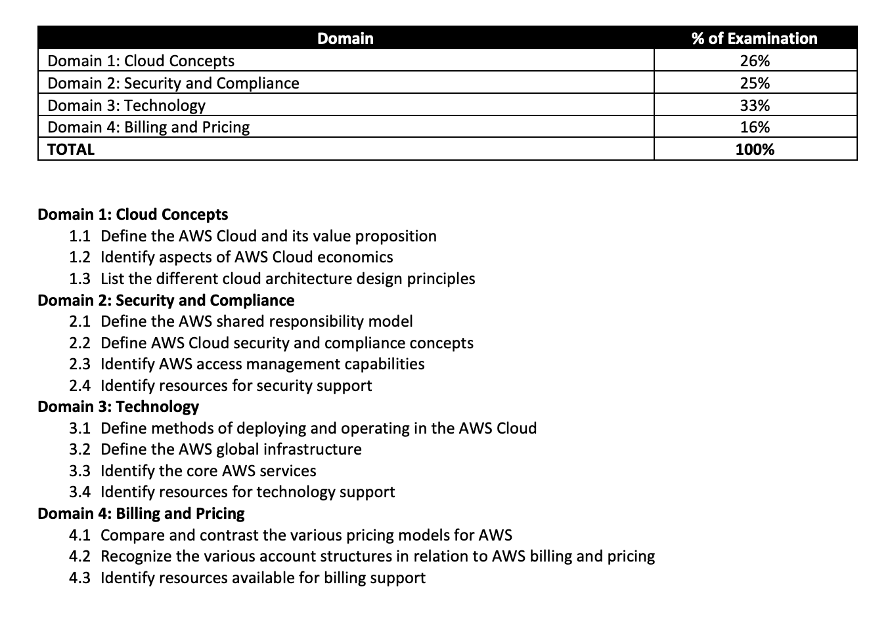

# AWS Cloud Practioner Course

I've bitten the bullet and have paid my subscription to Wizlabs for a year to study and learn about cloud computing. The courses here are cheap and I've read some great reviews.Here are the chapters of the online course















## What the Exam marks for

