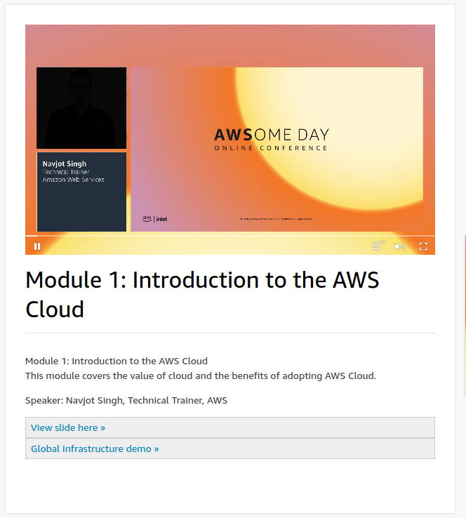

# Module 1: Introduction to the AWS Cloud

This module explains the basics of how AWS works.

What is the cloud? Online storage, streaming, Online applications, platforms and infrastructure as a service. Cloud service are products which delivers via internet.

AWS is a cloud service provider - IT resources and applications over the internet. provides anything you need, Servers, compute, applications, Storage, database over the internet.

Cloud deployments which are available are On premise Hybrid and Cloud

Benefits of AWS cloud? Traditionally when building servers they require planning with building configuring servers and data centers. this process consist of capacity planning, procurement and the construction of data centers. it would be timely and costly. 

Cloud allows you to reduce risk. Massive economics of scale. Stop guessing capacity. Increase speed and resources in minutes. You can expand data centers in different region.

3 mains ways to interact 

AWS management console

AWS CLI

AWS SDKS which supports Java, python, php, .net, Javascript, C++, Node and more

Summary: AWS provides on demand IT resources and services such as compute, storage, databases and more over the internet on a pay as you go model. AWS builds and manages the infrastructure or datacenters and the networks around the world organized into regions availability zone and edge location, you can leverage host your services

