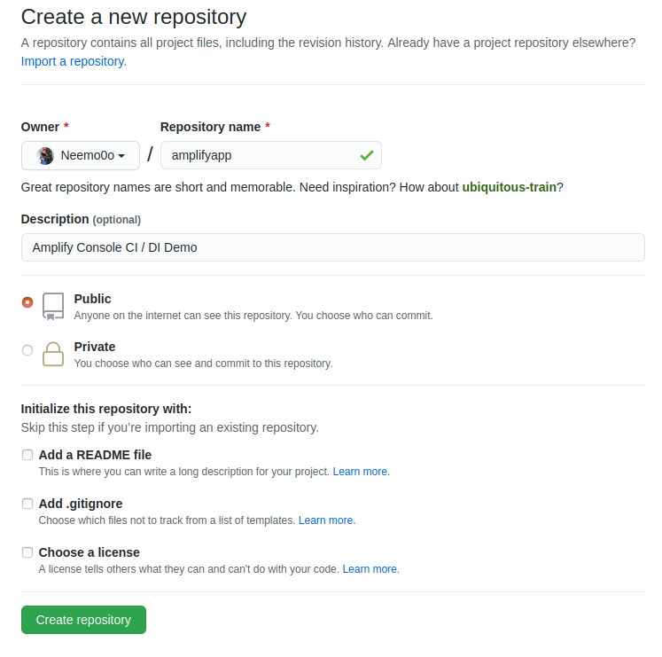
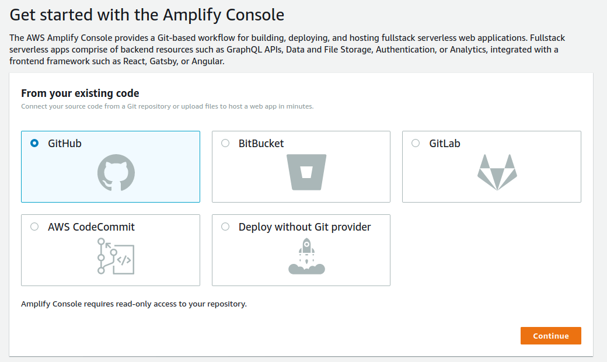
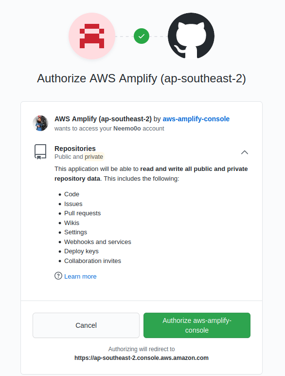
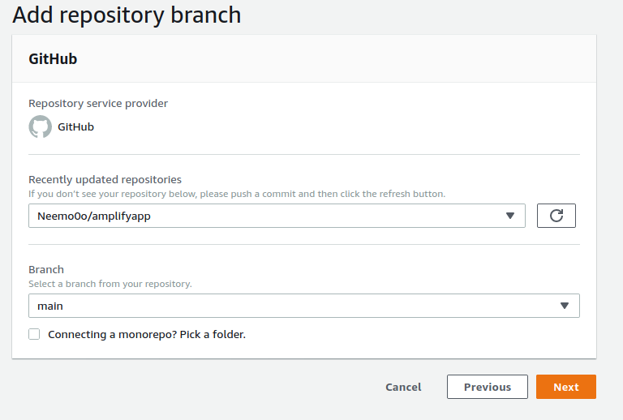
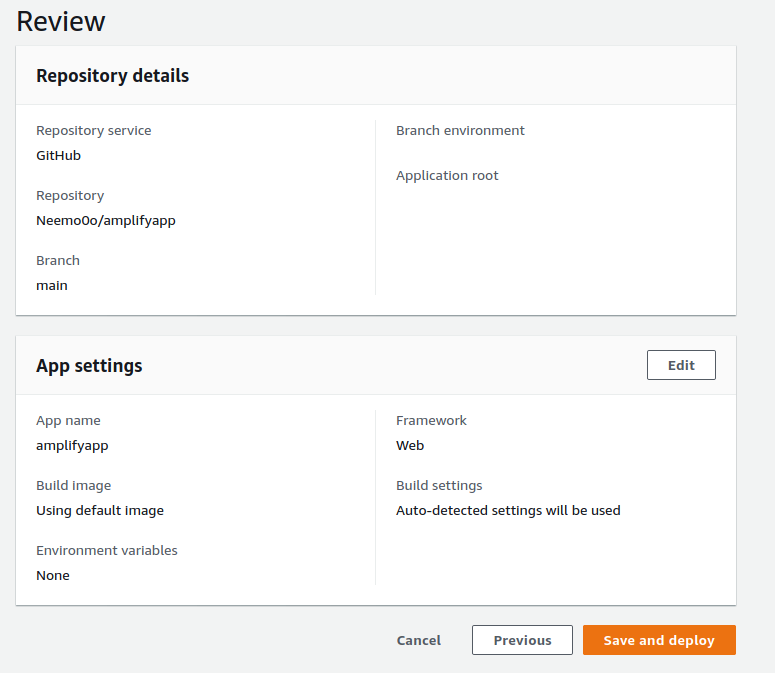
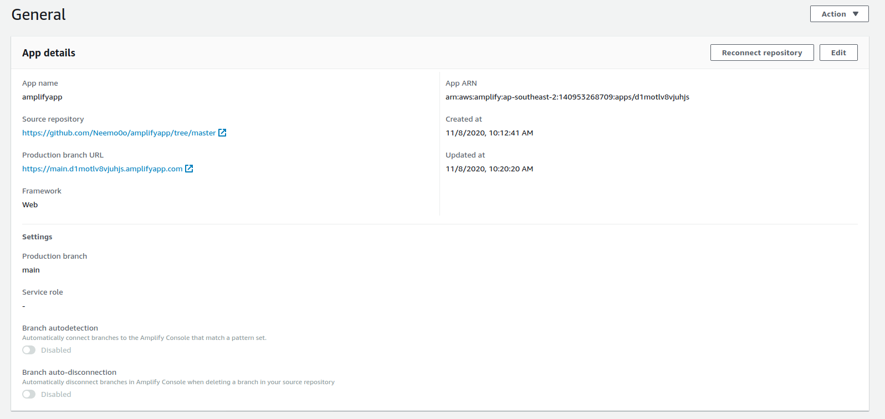

# Host a Static Website


Static websites deliver HTML, JavaScript, images, video and other files to your website visitors. Static websites are very low cost, provide high-levels of reliability, require almost no IT administration, and scale to handle enterprise-level traffic with no additional work.

**Host a static website** using [AWS Amplify](https://aws.amazon.com/amplify/console/) in the AWS console. AWS Amplify provides fully managed hosting for static websites and web apps. Amplify’s hosting solution leverages Amazon CloudFront and Amazon S3 to deliver your site assets via the AWS content delivery network \(CDN\).

**Set up continuous deployment:** Amplify offers a Git-based workflow with continuous deployment, allowing you to automatically deploy updates to your site on every code commit.

We need to create a repository in GitHub called amplifyapp then initialize then push the new application to github repo 



Open Terminal or Command prompt and run the below command

```text
echo "# amplifyapp" >> README.md
git init
git add README.md
git commit -m "first commit"
git branch -M main
git remote add origin https://github.com/Neemo0o/amplifyapp.git
git push -u origin main
```

This creates the files listed in the application then which it pushes onto the repo.

Open on to AWS Amplyfy and click Deploy, Conect yout Github account and local the 





Once loggeed in choose Amplify repo.This will the verfiy the code block and select save and deploy.







