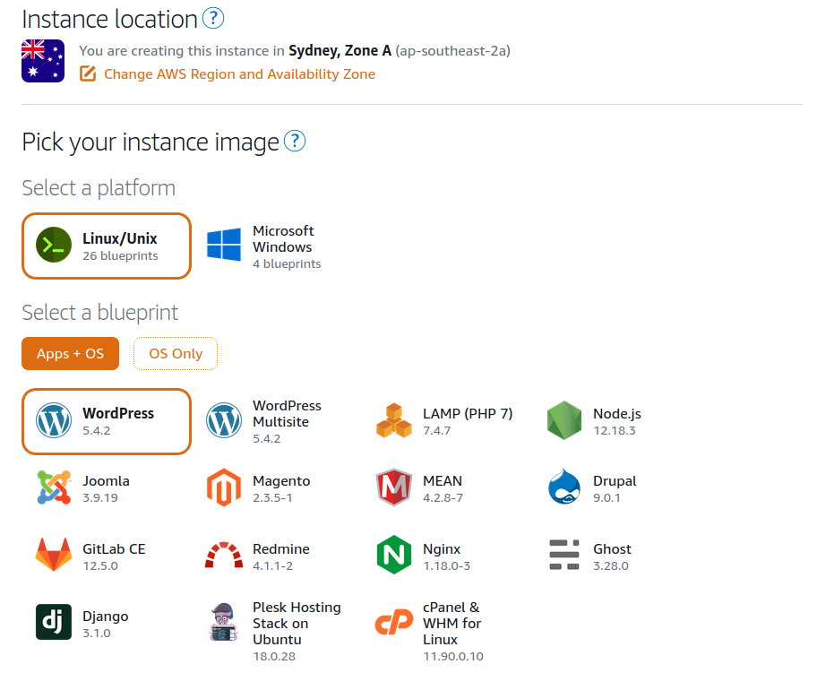
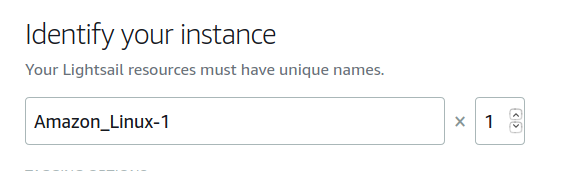
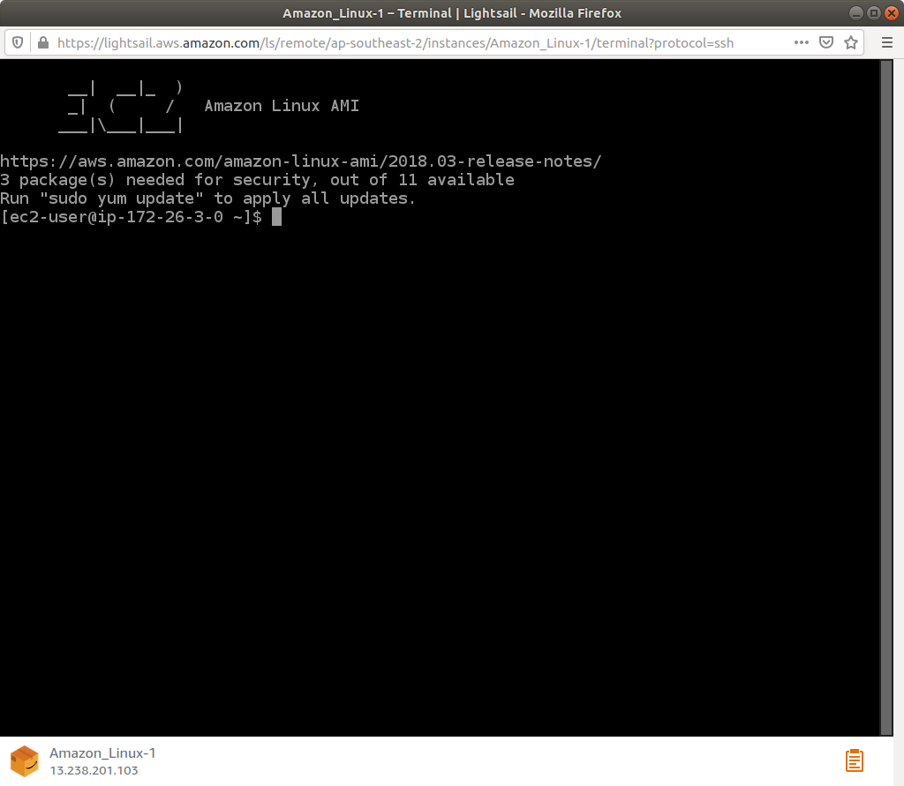

# Launch a Linux Virtual Machine

Here will be running through a basic creation of a Linux box using LightSail

Firstly Open Light sail and create an Instance

Choose the Availability zone and Region. Then select Linux Blue with OS

Next three options are optional. Launch Shell, enable snapshot and select SSH Keys

Choose your plan and enter name for you instance

Once finished, click on create instance and the instance will start pending. Congrats on creating a Linux Virtual machine using LightSail

