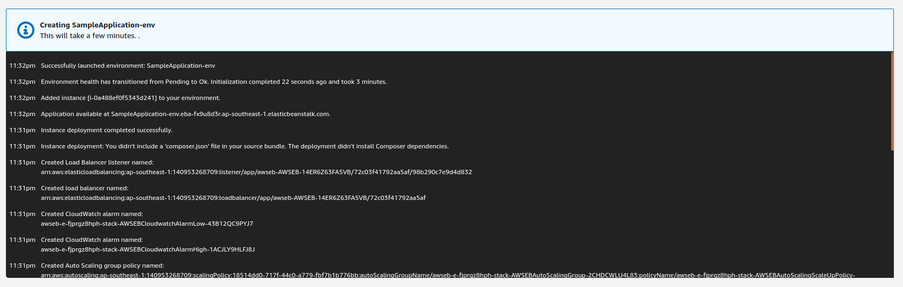
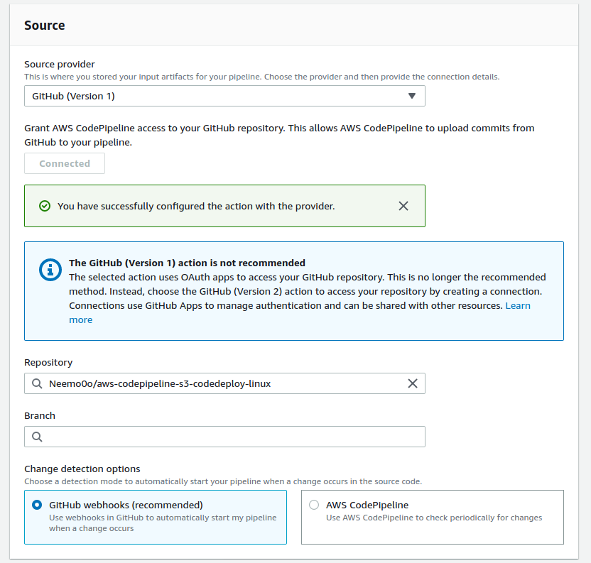

# Set up a Continuous Deployment Pipeline

[https://aws.amazon.com/getting-started/hands-on/continuous-deployment-pipeline/](https://aws.amazon.com/getting-started/hands-on/continuous-deployment-pipeline/)

We need to create Amazon ECS service first. Open up console and navigate to ECS.Click on create ECR,To simplify the process of setting up and configuring EC2 instances for this tutorial, you will spin up a sample environment using AWS Elastic Beanstalk. Elastic Beanstalk lets you easily host web applications without needing to launch, configure, or operate virtual servers on your own. It automatically provisions and operates the infrastructure \(e.g. virtual servers, load balancers, etc.\) and provides the application stack \(e.g. OS, language and framework, web and application server, etc.\) for you.

f you have created an Elastic Beanstalk application before, click: **Create New Application** on the upper-right corner. Name your application and create a new web server environment. Select PHP as your platform and Single Instance as your environment type. If you are planning to remote login to your instances, select a key pair. Otherwise, leave default values for the remaining options and create the environment for your continuous deployment pipeline

Elastic Beanstalk will begin creating a sample environment

Visit repo and fork out code 



Now open CodePipline and create new Pipeline. name your pipline then connect to GitHub repo then pull from account

